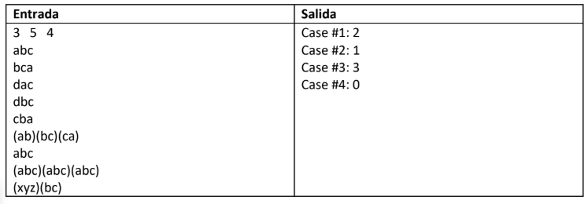

# idioma_alienigena
Código para identificar si una palabra pertenece a un patrón.

### Ejecución 🔧

_Ejecutar código python_

_Ingresar por consola 3 números enteros separados por espacio (L,D,N) que vienen siendo respectivamente: (L letras minusculas de las palabras, D palabras del idioma alienigena, N casos de prueba; patrones)_

